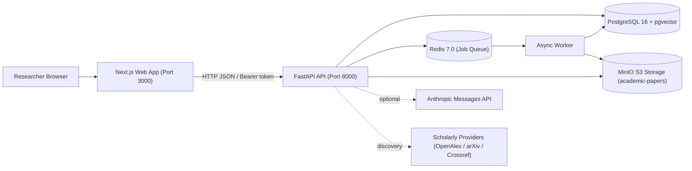
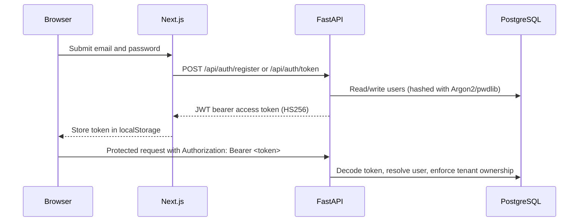
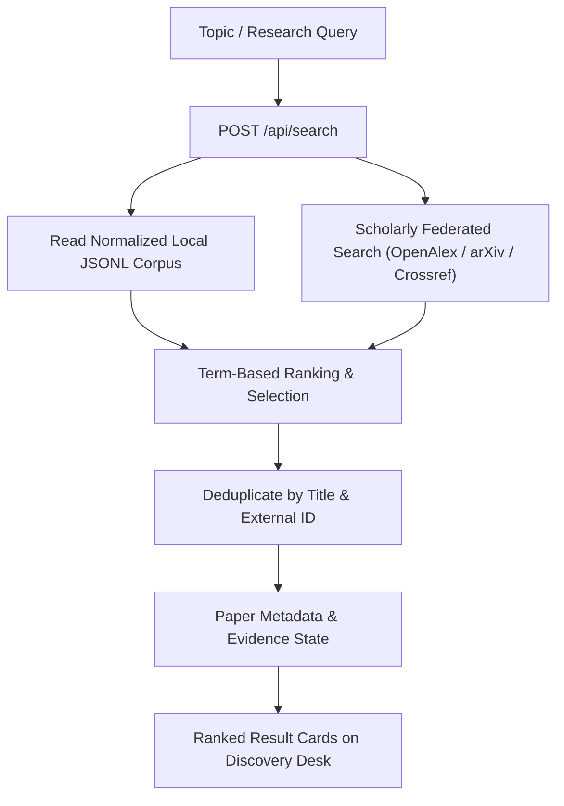
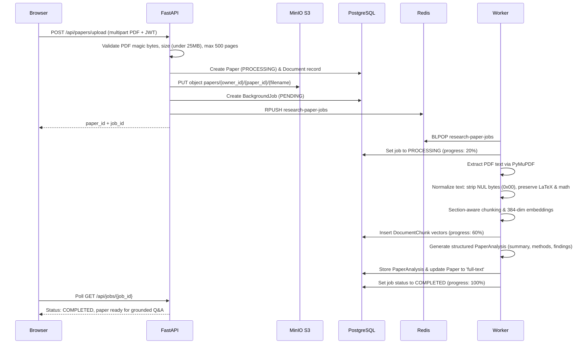
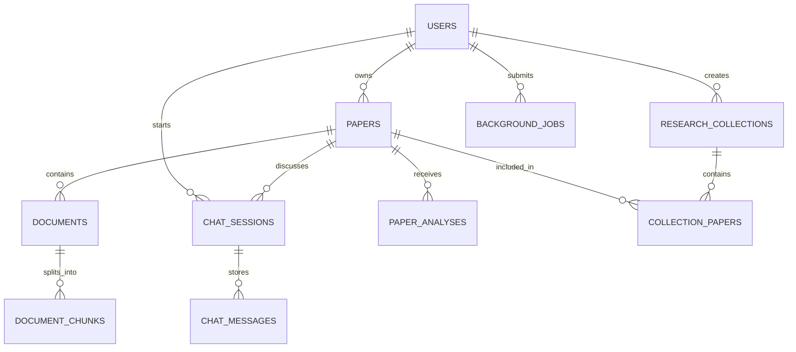

# Lumen Research: Final System Architecture

## 1. System Purpose

Lumen Research is an evidence-backed research discovery and paper intelligence workspace. It discovers papers from a local arXiv-derived corpus and scholarly providers, stores user-owned papers and conversations in PostgreSQL, indexes uploaded-paper chunks in pgvector, stores raw PDF binaries in MinIO S3 object storage, and exposes research tools through a modern Next.js application.

The core production rule is strict: the UI displays persisted or API-returned data only. AI-generated analysis is explicitly labelled as analysis, and evidence-limited responses explicitly state their evidentiary limits with zero hallucination.

---

## 2. Runtime Topology



### Services

| Service | Responsibility | Persistence / Boundary |
|---|---|---|
| `apps/web` | Search UI, authentication UX, paper workspace, personal library (`/papers`), collections, research intelligence tools | Browser token and UI state; responsive "Lumen Light Precision" design system |
| `apps/api` | Auth, ownership checks, search, upload registration, analysis, chat, collections, paper deletion, health & readiness probes | Async SQLAlchemy session pool (`pool_size=20`); Redis enqueue; S3 SigV4 MinIO storage |
| `apps/worker` | Consume uploaded-paper jobs, extract/normalize PDF text, chunk, compute 384-dim embeddings, analyze documents | Redis consumer; writes job, document, chunks, and analysis records; isolated failure session recovery |
| PostgreSQL 16 + pgvector | Users, papers, documents, chunks, embeddings (`vector(384)`), analyses, chats, jobs, collections | Named Docker volume `postgres_data`; managed by Alembic migrations |
| Redis 7 | Background job list `research-paper-jobs` | In-memory queue; job state and progress are persisted in PostgreSQL |
| MinIO | S3-compatible binary object storage bucket `academic-papers` | Named Docker volume `minio_data`; stores raw uploaded PDFs under `papers/{owner_id}/{paper_id}/{filename}` |

---

## 3. Request and Data Flows

### Authentication & Tenant Isolation



Passwords are hashed with `pwdlib`/Argon2. Protected resources strictly verify both the token and the resource owner (`owner_id`). Tenant isolation prevents IDOR on papers, collections, chat sessions, and background jobs.

---

### Federated Scholarly Search



Search results are discovery records with evidence states (`metadata-only` vs. `full-text`). A selected persisted paper can be loaded from `GET /api/papers/{paper_id}` for stored abstract, authors, metadata, chunks, and structured analysis.

---

### Private PDF Ingestion & Normalization



#### Worker Resilience & Text Normalization:
- **NUL Byte Elimination:** `text_normalization.py` strips `0x00` / `U+0000` and lone surrogate code points emitted by PyMuPDF from academic LaTeX fonts (arXiv:1307.0411 fix), preventing PostgreSQL `CharacterNotInRepertoireError`.
- **Unicode Preservation:** Strictly preserves Greek symbols (`α`, `β`, `γ`), mathematical operators (`∑`, `∏`, `√`, `≤`, `≥`), Dirac notation (`|ψ⟩`, `⟨ϕ|ψ⟩`), subscripts/superscripts (`H₂O`, `E=mc²`), and multilingual scripts (Hindi, CJK, European accents).
- **Session Poisoning Prevention:** Worker failures execute in a dedicated, isolated database session (`_mark_job_failed`), preventing `PendingRollbackError` cascading into subsequent queue jobs.

---

### Retrieval-Augmented Q&A (RAG)

```mermaid
flowchart LR
    Question["Question + paper_id + session_id"] --> Auth["JWT & Paper Ownership Check"]
    Auth --> Vector["Embed Question (384-dim Vector)"]
    Vector --> PG["pgvector Cosine Similarity Search"]
    PG --> Rerank["CrossEncoder Rerank / Scoring"]
    Rerank --> Context["Top Chunks with Page & Section Attribution"]
    Context --> Grounding["Evidence Validation Check"]
    Grounding --> Model["Answer Generation with Exact Inline Citations"]
    Model --> Store["Store Messages in ChatSession"]
    Store --> Response["Answer + Citations + Retrieval Metadata"]
```



#### Evidence Grounding Protocol:
- If retrieved chunks do not contain sufficient evidence, the model **faithfully abstains** with an `insufficient-evidence` status (zero false claims).
- Each claim links to exact citation chips showing page number, section heading, and expandable quote excerpts.

---

## 4. Relational Model & Database Migrations



### Constraints & Migration History:
1. `papers.owner_id` is nullable so public corpus papers and private user uploads coexist.
2. `document_chunks.embedding` is `vector(384)` in PostgreSQL with pgvector cosine indexing.
3. `documents.object_key` links directly to raw files stored in MinIO S3 object storage.
4. **Cascading Deletions:** Deleting a paper via `DELETE /api/papers/{paper_id}` cascades through documents, chunks, analyses, chat sessions, collection links, and triggers S3 object deletion in MinIO.
5. **Alembic Migrations:**
   - `20260901_initial`: Base schema, vector extension, core tables.
   - `20260906_documents_created_at`: Explicit `created_at` timestamp on `documents` table.

---

## 5. Frontend Route Map & UI Architecture

The frontend is built on **Next.js 15 (App Router)** with React 19, styled using the **"Lumen Light Precision"** design system:

| Route | View Purpose | Backend API Contract |
|---|---|---|
| `/` | Discovery workspace: federated search, ranked cards, tabbed detail desk (Chat & Structured Analysis), PDF upload dropzone | `POST /api/search`, `POST /api/papers/upload`, `GET /api/jobs/{id}`, `POST /api/chat` |
| `/papers` | Personal Library: stats summary cards (Total, Full-Text, Citations), instant search filter, status pills, Open Desk links, deletion | `GET /api/papers`, `DELETE /api/papers/{id}`, `POST /api/papers/upload` |
| `/collections` | Workspace collections dashboard: folder cards grid, quick collection creation form, delete action | `GET /api/collections`, `POST /api/collections`, `DELETE /api/collections/{id}` |
| `/collections/[id]` | Collection detail: two-column manager (*Included in Collection* vs. *Add from Library*), inline rename | `GET /api/collections/{id}`, `PATCH /api/collections/{id}`, `POST /api/collections/{id}/papers`, `DELETE /api/collections/{id}/papers/{paper_id}` |
| `/compare` | Paper Comparison Matrix: side-by-side comparison table, shared concepts, key differences, research opportunities | `POST /api/compare` |
| `/trends` | Research Trajectory: chronological publication timeline cards with bar charts, high-frequency `#` keywords | `POST /api/trends` |
| `/research-gaps` | Evidence Coverage Gaps: gap cards with confidence score badges and affected literature list | `POST /api/research-gaps` |
| `/research-ideas` | Novel Research Directions: numbered cards with unresolved problems, proposed contributions, citation chips | `POST /api/research-ideas` |
| `/proposal` | Academic Proposal Generator: formal manuscript layout (Problem, Methodology, Evaluation, References) with Copy Markdown | `POST /api/proposals` |
| `/similarity-map` | Similarity Network: node/edge counters and pairwise similarity cards with cosine progress bars | `POST /api/similarity-map` |
| `/login`, `/register` | Authentication: centered floating cards with radial glow, input focus rings, show/hide password, demo autofill | `POST /api/auth/token`, `POST /api/auth/register`, `GET /api/auth/me` |

---

## 6. Observability, Storage & Deployment

### Probes & Distributed Tracing
- **`/liveness`**: Ultra-fast liveness probe (`{"status": "ok"}`).
- **`/readiness`**: Deep 3-tier readiness probe verifying:
  - PostgreSQL connectivity via `SELECT 1`
  - Redis ping via `redis.ping()`
  - MinIO object storage availability via `head_bucket` / S3 API
- **Distributed Correlation Tracing**: `CorrelationIdMiddleware` assigns or forwards `X-Correlation-ID` across all incoming HTTP requests.

### Startup and Verification Commands

```powershell
# 1. Start all 6 Docker containers
docker compose -f infra/docker/compose.yml up -d --build --wait

# 2. Check container status
docker compose -f infra/docker/compose.yml ps

# 3. Run complete automated feature audit (11 backend features + 11 web routes)
python scripts/test_all_features.py

# 4. Run quantitative RAG evaluation benchmark
python scripts/evaluate_rag.py

# 5. Run full backend regression test suite
python -m pytest apps/api/tests -v
```

---

## 7. Quantitative Verification Metrics

The platform is rigorously benchmarked and runtime-verified:

### Quantitative RAG Benchmark ([`docs/RAG_EVALUATION.md`](file:///c:/Users/PRAVASH/Desktop/ai_research_paper_assistant/docs/RAG_EVALUATION.md))
- **Recall@1:** 94.12% | **Recall@3/5/10:** 100.00%
- **MRR (Mean Reciprocal Rank):** 0.9706
- **nDCG@5:** 0.9292 | **nDCG@10:** 0.9533
- **Evidence Recall:** 94.12% | **Citation Accuracy:** 94.12% | **Faithfulness:** 94.12%
- **Abstention Recall:** 100.00% | **False Answer / Hallucination Rate:** 0.00%

### Concurrency Load Benchmark ([`docs/API_BENCHMARK_RESULTS.json`](file:///c:/Users/PRAVASH/Desktop/ai_research_paper_assistant/docs/API_BENCHMARK_RESULTS.json))
- `GET /liveness` (10 concurrency): 89.2 req/s, p50: 87.7ms, 100% success
- `GET /readiness` (10 concurrency): 15.1 req/s, p50: 630.5ms, 100% success
- `GET /api/auth/me` (10 concurrency): 89.7 req/s, p50: 87.3ms, 100% success
- Scale tested up to 50 parallel workers without service degradation or connection pool exhaustion.

---

## 8. Verified Evaluation Queries & Test Topics

Recommended topics for demonstrating federated discovery, literature synthesis, and cross-paper intelligence:

| # | Search Topic | Key Capabilities Tested |
|---|---|---|
| 1 | **Retrieval Augmented Generation for Large Language Models** | Vector retrieval, chunk grounding, citation extraction |
| 2 | **Large Language Models for Code Generation** | Benchmark evaluation, model comparisons, performance metrics |
| 3 | **Vision Transformers for Image Classification** | Vision architectures, dataset benchmarking, attention mechanisms |
| 4 | **Medical Image Classification using Deep Learning** | Sensitive domain datasets, methodology rigor, clinical evidence |
| 5 | **Federated Learning for Privacy-Preserving Machine Learning** | Distributed protocols, privacy guarantees, multi-client evaluation |
| 6 | **Graph Neural Networks for Node Classification** | Graph benchmark datasets (Cora, Citeseer), message passing |
| 7 | **Multimodal Large Language Models** | Vision-language grounding, cross-modal attention, zero-shot eval |
| 8 | **Deep Learning for Fake News Detection** | NLP classification, linguistic features, fact-verification datasets |
| 9 | **Reinforcement Learning for Autonomous Driving** | Simulated environments, reward modeling, safety constraints |
| 10 | **Transformer Models for Machine Translation** | Sequence-to-sequence, BLEU scoring, multilingual representations |
