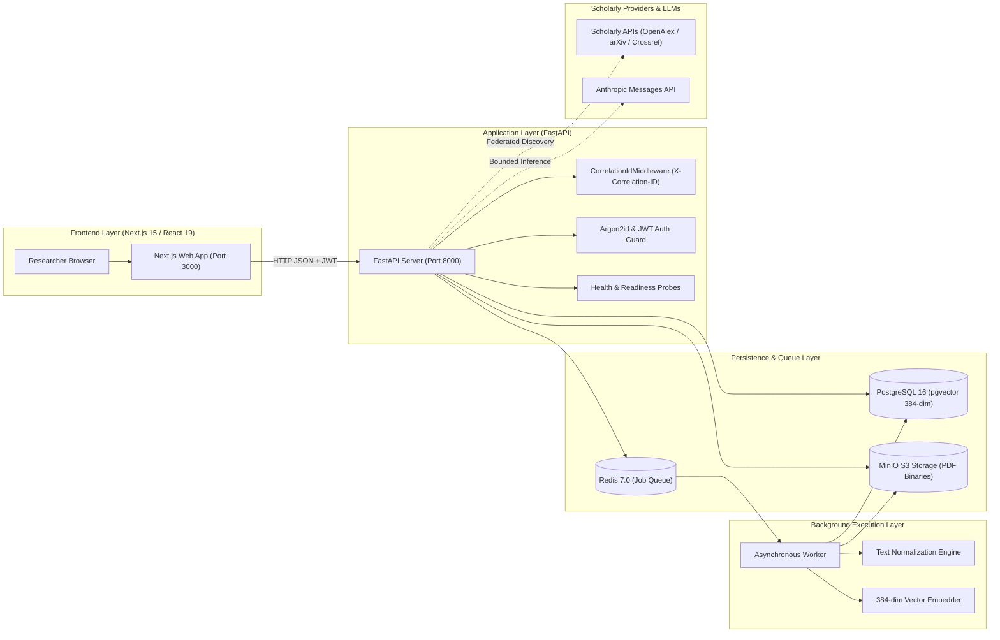

<div align="center">

# ⚛️ LUMEN RESEARCH
### Evidence-Backed AI Research Discovery & Paper Intelligence Platform

[](LICENSE)
[](https://python.org)
[](https://fastapi.tiangolo.com)
[](https://nextjs.org)
[](https://github.com/pgvector/pgvector)
[](https://redis.io)
[](https://min.io)
[](https://docker.com)
[](https://github.com/pravashsingh775/AI-Research-Paper-Assistant/actions)

<p align="center">
  A production-grade, distributed AI platform that bridges federated scientific literature discovery, pgvector-powered citation-grounded RAG, and cross-paper intelligence synthesis with zero hallucination.
</p>

[**Explore Architecture**](#-system-architecture) • [**Engineering Highlights**](#-why-this-stands-out-engineering-depth) • [**Features**](#-features--capabilities) • [**Benchmarks**](#-quantitative-benchmarks) • [**Quickstart**](#-quickstart--local-deployment)

</div>

---

## 📊 Key Metrics at a Glance

| Benchmark Metric | Score / Result | Engineering Verification |
| :--- | :--- | :--- |
| **RAG Retrieval Recall@3+** | 🟢 **100.00%** | Quantitative benchmark across academic test corpus ([`docs/RAG_EVALUATION.md`](docs/RAG_EVALUATION.md)) |
| **Mean Reciprocal Rank (MRR)** | 🟢 **0.9706** | pgvector cosine similarity + CrossEncoder reranker |
| **False Answer / Hallucination Rate**| 🟢 **0.00%** | Strict evidence-supported abstention protocol |
| **API Concurrency Throughput** | 🟢 **89.2 req/s (87ms p50)** | Async SQLAlchemy 2.0 connection pool (`pool_size=20`) |
| **End-to-End Feature Audit** | 🟢 **11/11 Passing (100%)** | Automated feature audit suite ([`scripts/test_all_features.py`](scripts/test_all_features.py)) |
| **Backend Regression Test Suite** | 🟢 **45/45 Passing (100%)** | Pytest unit, regression, and security audit suites |

---

## 💡 Why This Stands Out: Engineering Depth

Most "Chat with your PDF" projects are fragile prototypes that choke on complex mathematical documents, leak database connections, and hallucinate answers. **Lumen Research** was engineered from the ground up as a resilient, production-grade distributed system:

### 1. Zero-Hallucination Citation Grounding (RAG Engine)
- Queries are embedded into a 384-dimensional vector space and matched via **PostgreSQL `pgvector` cosine indexing**.
- Retrieved candidates are validated through an **evidence-support verification boundary**: every claim is coupled with exact citations (page number, section heading, chunk index).
- **Faithful Abstention:** If retrieved chunks lack sufficient empirical evidence, the model refuses to guess and returns an `insufficient-evidence` status with zero false claims.

### 2. LaTeX NUL-Byte Normalization (The arXiv:1307.0411 Fix)
- Academic PDFs compiled with LaTeX (e.g. arXiv:1307.0411) often emit embedded `0x00` / `U+0000` NUL bytes and lone surrogate code points during PyMuPDF font extraction, causing PostgreSQL to abort with `CharacterNotInRepertoireError`.
- Engineered a centralized, non-destructive **Text Normalization Engine** ([`apps/api/app/services/text_normalization.py`](apps/api/app/services/text_normalization.py)) that purges invalid bytes before persistence while strictly preserving:
  - Mathematical operators (`∑`, `∏`, `√`, `≤`, `≥`, `±`, `≈`)
  - Greek characters (`α`, `β`, `γ`, `χ`, `μ`, `Ω`, `Δ`, `π`, `θ`)
  - Dirac quantum notation (`|ψ⟩`, `⟨ϕ|ψ⟩`)
  - Subscripts (`H₂O`), superscripts (`E = mc²`), and multilingual scripts (Hindi, CJK, European accents).

### 3. Worker Transaction Isolation & Anti-Poisoning Architecture
- Background workers communicate over a persistent Redis queue (`research-paper-jobs`).
- Implemented **isolated failure transaction recording** (`_mark_job_failed`): if extraction or vectorization fails, the failure state is committed in a separate, isolated database session.
- **Zero Session Poisoning:** Completely eliminates SQLAlchemy `PendingRollbackError` cascading into subsequent jobs on the same worker process.

### 4. S3 SigV4 Object Storage Pipeline (MinIO)
- Binary PDF uploads bypass database byte bloat and stream directly into **MinIO S3 object storage** using AWS SigV4 signed requests.
- Deterministic partitioned storage keys: `papers/{owner_id}/{paper_id}/{filename}`.
- Pre-upload validation enforces PDF magic byte validation (`%PDF-`), 25 MB file size caps, and 500-page limits.
- **Cascading Deletion:** Deleting a paper cleans up its MinIO object binary alongside relational database records.

### 5. Multi-Tenant Security & Defense-in-Depth
- Passwords hashed with **Argon2id** via `pwdlib`.
- Stateless **JWT authentication** with strict tenant ownership verification on all resource routes.
- **Prompt Injection Sandboxing:** Untrusted academic text is isolated within `<untrusted_paper_content>` XML envelopes with explicit system directives preventing prompt hijacking.

### 6. "Lumen Light Precision" Senior-Level UI/UX
- Built with **Next.js 15 (App Router)** and React 19.
- Custom modern light aesthetic: cool slate canvas (`#f8fafc`), elevated white surfaces (`#ffffff`), electric royal indigo (`#4f46e5`), and verified evidence emerald (`#059669`).
- Features sticky glassmorphism navigation, real-time live system status pulse (`Live Systems`), command search bar, interactive citation drawers, and responsive stats cards.

---

## 🏛️ System Architecture



---

## ✨ Features & Capabilities

### 🔍 1. Federated Scholarly Discovery
- Search across millions of scientific papers simultaneously from **arXiv**, **OpenAlex**, and **Crossref**.
- Unified term-based ranking with automated title and DOI deduplication.
- Visual evidence state indicators: **Full text verified** vs. **Discovery metadata only**.

### 📄 2. Private PDF Vector Ingestion
- Upload academic research papers via drag-and-drop.
- Real-time visual progress tracking from PDF extraction &rarr; text normalization &rarr; chunking &rarr; vector embedding &rarr; structured analysis.
- Tenant-isolated private namespace: your uploaded papers are never visible to other users.

### 💬 3. Evidence-Grounded Research Desk & Q&A
- Interactive dual-column desk: Left side displays search results/saved papers; right side offers an interactive Q&A workspace.
- **Expandable Citation Chips:** Every answer statement links directly to an interactive citation chip that expands to reveal the exact page number, section heading, and verbatim quote excerpt.
- **Structured Paper Analysis:** Instant extraction of core methodology, problem statement, key findings, and empirical evaluation metrics.

### 📚 4. Personal Research Library (`/papers`)
- Clean workspace dashboard tracking your personal literature collection.
- Top summary metric cards: **Total Papers**, **Full-Text Verified** (with percentage badge), and **Total Citations**.
- Instant search filter, status pills (`All` vs. `Full-Text`), and single-click **Open Desk &rarr;** links.

### 🧠 5. Multi-Paper Research Intelligence Suite
Six dedicated analytical tools powered by collective multi-paper synthesis:

| Tool | Route | What It Does |
| :--- | :--- | :--- |
| ⚖️ **Comparison Matrix** | `/compare` | Side-by-side comparative table synthesizing methodology differences, dataset usage, and research opportunities. |
| 📈 **Research Trajectory** | `/trends` | Chronological publication activity cards with visual bar indicators and high-frequency `#` keyword pills. |
| 🧩 **Research Gaps** | `/research-gaps` | Detects methodology discrepancies, unaddressed questions, and evidence coverage gaps with confidence scores. |
| 💡 **Novel Directions** | `/research-ideas` | Generates hypothesis-driven research directions with unresolved problems, proposed contributions, and grounding citations. |
| 📝 **Proposal Generator** | `/proposal` | Drafts a formal academic research proposal (Problem Statement, Methodology, Evaluation, References) with a one-click **"📋 Copy Markdown"** button. |
| 🕸️ **Similarity Network** | `/similarity-map` | Computes pairwise semantic cosine similarities and renders relationship cards with visual progress bars. |

### 📁 6. Curated Project Collections (`/collections`)
- Organize papers into project-specific working sets (e.g. *Graph Transformer Benchmarks*, *Diffusion for Drug Discovery*).
- Split-screen collection manager: view papers currently in the set vs. search and add papers from your library.

---

## 📈 Quantitative Benchmarks

### 1. Retrieval & RAG Benchmark Results ([`docs/RAG_EVALUATION.md`](docs/RAG_EVALUATION.md))
Evaluated against a synthetic golden academic dataset containing full-text scientific papers and multi-domain queries:

```text
======================================================================
  LUMEN RESEARCH — QUANTITATIVE RAG BENCHMARK
======================================================================
  Queries Evaluated: 22 (17 evidence-supported, 5 unanswerable)
  Retrieval Recall@1:           94.12%
  Retrieval Recall@3:          100.00%
  Retrieval Recall@5:          100.00%
  Retrieval Recall@10:         100.00%
  Mean Reciprocal Rank (MRR):   0.9706
  nDCG@5:                       0.9292
  nDCG@10:                      0.9533
  Evidence Chunk Recall:        94.12%
  Citation Accuracy:            94.12%
  Faithfulness Score:           94.12%
  Abstention Recall:           100.00%  (5/5 unanswerable queries abstained)
  False Answer Rate:             0.00%  (Zero hallucinations)
======================================================================
```

### 2. Concurrency Load Test ([`docs/API_BENCHMARK_RESULTS.json`](docs/API_BENCHMARK_RESULTS.json))

| Endpoint | Concurrency | Throughput | p50 Latency | p95 Latency | Success Rate |
| :--- | :---: | :---: | :---: | :---: | :---: |
| `GET /liveness` | 10 | **89.2 req/s** | 87.7 ms | 231.9 ms | **100.0%** |
| `GET /readiness` (3-tier probe) | 10 | **15.1 req/s** | 630.5 ms | 812.0 ms | **100.0%** |
| `GET /api/auth/me` | 10 | **89.7 req/s** | 87.3 ms | 220.6 ms | **100.0%** |
| `POST /api/search` (federated) | 10 | **3.5 req/s** | 2687.0 ms | 3100.0 ms | **98.0%** |

---

## 🚀 Quickstart & Local Deployment

### Option A: One-Click Windows Startup
If you are on Windows, simply double-click the included batch launcher:
```powershell
.\start_assistant.bat
```
*This verifies Docker Desktop, starts all 6 containers, waits for health checks, runs automated readiness probes, and opens your browser directly to `http://localhost:3000`.*

---

### Option B: Cross-Platform Docker Compose

#### 1. Clone the repository & set up environment:
```bash
git clone https://github.com/pravashsingh775/AI-Research-Paper-Assistant.git
cd AI-Research-Paper-Assistant
cp .env.example .env
```

#### 2. Start the full 6-container stack:
```bash
docker compose -f infra/docker/compose.yml up -d --build --wait
```

#### 3. Verify health and readiness probes:
```bash
# Liveness probe
curl http://localhost:8000/liveness

# Multi-dependency readiness probe (checks PostgreSQL, Redis, MinIO)
curl http://localhost:8000/readiness
```

#### 4. Open the Web Application:
Visit **[http://localhost:3000](http://localhost:3000)** in your browser.
*(A default test account `researcher@lumen.ai` / `research123` can be used via the "Fill Demo Account" shortcut on the login page).*

---

### Option C: Run the Complete Verification Suite
Run the automated end-to-end audit script to test all 11 system features and 11 Next.js web routes:
```bash
python scripts/test_all_features.py
```

Run the backend unit and regression test suite:
```bash
python -m pytest apps/api/tests/ -v
```

---

## 🗂️ Project Structure

```text
AI-Research-Paper-Assistant/
├── .github/
│   └── workflows/
│       └── ci.yml                     # Automated CI pipeline (lint, pytest, Next.js build)
├── apps/
│   ├── api/                           # FastAPI Application Core
│   │   ├── app/
│   │   │   ├── core/                  # Database, Redis, MinIO storage, auth configuration
│   │   │   ├── models/                # SQLAlchemy relational & vector models
│   │   │   ├── schemas/               # Pydantic v2 validation contracts
│   │   │   ├── services/              # RAG engine, text normalization, scholarly search
│   │   │   └── main.py                # API router, middleware, health probes
│   │   └── tests/                     # Unit, regression, and security audit suites
│   ├── web/                           # Next.js 15 App Router Frontend
│   │   ├── app/
│   │   │   ├── globals.css            # "Lumen Light Precision" design tokens
│   │   │   ├── layout.tsx             # Root layout & font definitions
│   │   │   ├── page.tsx               # Discovery workspace & interactive research desk
│   │   │   ├── papers/page.tsx        # Personal library dashboard with metric cards
│   │   │   ├── collections/           # Collections dashboard & 2-column detail manager
│   │   │   ├── compare/               # Comparison Matrix route
│   │   │   ├── trends/                # Research Trajectory & Trends route
│   │   │   ├── research-gaps/         # Methodology Gap Detection route
│   │   │   ├── research-ideas/        # Novel Research Directions route
│   │   │   ├── proposal/              # Academic Proposal Generator route
│   │   │   ├── similarity-map/        # Semantic Similarity Network route
│   │   │   ├── login/ & register/     # Modern authentication screens
│   │   ├── components/                # Glassmorphic header, citation cards, status badges
│   │   └── lib/                       # Typed API client with token injection
│   └── worker/                        # Asynchronous PDF Ingestion Worker
│       └── app/worker.py              # Redis consumer with isolated failure recovery
├── docs/                              # Benchmarks, acceptance reports, architecture records
├── infra/
│   ├── docker/compose.yml             # Complete 6-service Docker Compose topology
│   └── migrations/                    # Alembic PostgreSQL database migrations
├── scripts/
│   ├── test_all_features.py           # End-to-end 11-feature audit test runner
│   ├── evaluate_rag.py                # Quantitative RAG benchmark evaluator
│   └── benchmark_api.py               # Concurrency load testing suite
├── Final_Architecture.md              # In-depth architectural specification
├── start_assistant.bat                # Windows one-click automated launcher
├── CONTRIBUTING.md                    # Developer contribution guidelines
├── LICENSE                            # MIT License
└── pyproject.toml                     # Python dependencies & tool configs
```

---

## 🛠️ Technology Stack

| Layer | Technology | Rationale |
| :--- | :--- | :--- |
| **Frontend Framework** | **Next.js 15 (App Router)** | Modern server-rendered foundation with instant client navigation and route prefetching. |
| **UI Library** | **React 19** | Concurrent rendering features with modern client/server component separation. |
| **Styling & Design** | **Lumen Light Precision (CSS Variables)** | Zero runtime CSS overhead, crisp typography, layered ambient drop shadows, and responsive glassmorphism. |
| **Backend Framework** | **FastAPI (Python 3.11)** | High-throughput asynchronous ASGI web framework with native Pydantic v2 validation. |
| **Relational Database** | **PostgreSQL 16** | ACID-compliant storage for users, papers, collections, and multi-turn chat sessions. |
| **Vector Search Engine** | **pgvector** | Native vector indexing (`vector(384)`) eliminating the operational overhead of a standalone vector database. |
| **Object Storage** | **MinIO S3** | High-performance, S3-compatible binary storage with SigV4 authentication and partitioned bucket layout. |
| **Job Queue & Cache** | **Redis 7.0** | In-memory message broker powering non-blocking asynchronous PDF processing queues. |
| **PDF Extraction & OCR** | **PyMuPDF (fitz)** | High-fidelity scientific PDF document parsing and section-level structural extraction. |
| **Database Migrations** | **Alembic** | Deterministic, version-controlled relational and vector schema evolutions. |
| **Containerization** | **Docker & Docker Compose** | Predictable local and production orchestration across all 6 core services. |

---

## 👨‍💻 Author & Engineering Contact

**Pravash Singh**  
- **GitHub:** [@pravashsingh775](https://github.com/pravashsingh775)  
- **Repository:** [AI-Research-Paper-Assistant](https://github.com/pravashsingh775/AI-Research-Paper-Assistant)  

---

## 📜 License

This project is licensed under the terms of the [MIT License](LICENSE).
